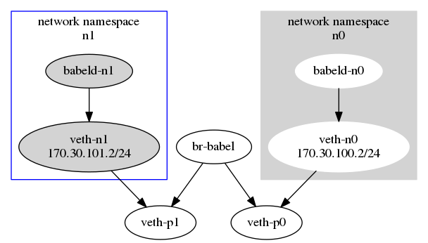

# babeld-lab
a virtual network lab for babeld experiments

The purpose of this project is to set up a virtual babel mesh for educational and testing purposes. 

*This is a work in progress.*

# requirements
1. a linux of sorts
1. [make](https://www.gnu.org/software/make/)
1. [git](https://git-scm.com) (using ```sudo apt-get install git``` perhaps)
1. [babeld](https://github.com/jech/babeld)
1. [wireshark](https://wireshark.org) or at least [tshark](https://www.wireshark.org/docs/man-pages/tshark.html)
1. [ip](http://man7.org/linux/man-pages/man8/ip.8.html) 
1. [bridge-utils](http://www.linuxfromscratch.org/blfs/view/svn/basicnet/bridge-utils.html) or at least [brctl](https://linux.die.net/man/8/brctl)

# building a virtual n-node babel mesh
To build an experimental setup that connects (virtual) babel nodes without having to mess around with physical hardware, various techniques can be used. One of them is using linux's veth, brctr, and ip to create virtual network interfaces and bridges and to isolate them using namespaces. 

[Docker](https://docker.com) is using similar techniques (network namespaces) under the hood to configure network interfaces. Docker provides much more functionality, but for our intended purposes we don't need full-blown docker containers to demonstrate how babeld works.

We're trying to build something like:

[](./diagram.png)

# step 0: clone this repository

```git clone https://github.com/sudomesh/babeld-lab.git```

# step 1: add interfaces
This adds a variable number of virtual network interfaces based on user input

```
cd babeld-lab 
sudo ./babeld-lab.sh -a <$n number of nodes>
```
Verify that ```ip addr``` now contains br-babel and veth-p0 through veth-p($n-1).  You may also check that ```sudo ip netns exec n0 ip addr``` contains veth-n0 and ```sudo ip netns exec n1 ip addr``` contains veth-n1, and so on for $n interfaces.  The state of all interfaces should be down.

# step 2: turn interfaces on
```
sudo ./babeld-lab.sh -u
```
Verify that the ```ip addr``` cmds of step 1 now indicate that all of the interfaces are up.

# step 3: start babeld nodes
```
sudo ./babeld-lab.sh -s
```
Log and process id files for started babel nodes should now be created (e.g. ```babel0.log```, ```babel0.pid```).

Verify that ```sudo ip netns exec n0 ip route``` contains the routes to all other nodes. Depending on the number of nodes you created and the speed of your processor, this may take quite a while for the network to converge (or it may never converge?). If convergence is successful your output should appear as follows:
```
170.30.100.0/24 dev veth-n0 proto kernel scope link src 170.30.100.2 
170.30.101.2 via 170.30.101.2 dev veth-n0 proto babel onlink
170.30.102.2 via 170.30.102.2 dev veth-n0 proto babel onlink
.
.
.
170.30.(100+$n).2 via 170.30.(100+$n-1).2 dev veth-n($n-1) proto babel onlink
``` 
This may be repeated for any node of your choosing. Notice that all the nodes should appear directly connected (that is the ip address on both sides of the "via" is the same) this is because their is only one bridge to which all the nodes are connected. If you are lucky, you may notice shortly after the you start the babeld process, while the network is still converging, nodes may be routing via to one node via another node. If so, you may see something like this '''170.30.102.2 via 170.30.106.2''' (note: this phenomenon will be cool to investigate further once the we add the ability to dynamically add and remove bridges).

To run any command within a particular namespace use ```sudo ip netns exec n0 <insert command here>```.
 For example, you can run netcat between the two namespaces.  In one terminal, run ```sudo ip netns exec n0 nc -l -p 80```.  In another terminal, run ```sudo ip netns exec n1 nc 170.30.100.2 80```.  Now your two namespaces will be able to talk to one another.  Type "pizza" into the the second terminal and "pizza" should appear in the first terminal.

# step 4: monitor babel toggle bridge (this functionality has been deprecated)
To monitor the babel chatter, start wireshark and select br-babel interface:  You should see babel hello and babel ihu (I hear you) messages going back and forth.

When disabling the bridge (similar to unplugging nodes from a network switch), using something like ```sudo ./babeld-lab.sh down_bridge```, the routing tables of n0 and n1 network namespaces should clear out, and traffic should stop.

You can monitor the node logs (e.g. ```babel0.log```), and you'll notice the routes aging and eventually being removed. This process might take a minute or two.

After the route expires, the ```sudo ip netns exec n0 ip route``` should no longer contain entries like ```170.30.101.2 via 170.30.101.2 dev veth-n0  proto babel onlink```.  

Enabling using ```sudo ./babeld-lab.sh up_bridge``` should restart the network, reintroduce the chatter, and re-establish the routes.

# step 5: stop and delete the network
After doing the experiments, stop babeld using ```sudo ./babeld-lab.sh -e```.  Set the interfaces to down using ```sudo ./babeld-lab.sh -d```.  Finally, remove any number of network interfaces with ```sudo ./babeld-lab -r <number of nodes to be removed>```. This will remove the highest numbered interfaces first by default. 


